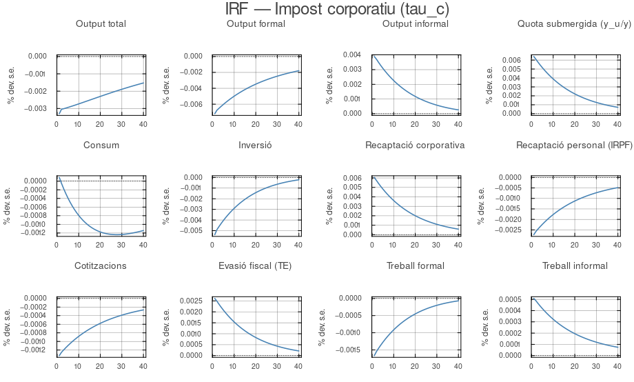
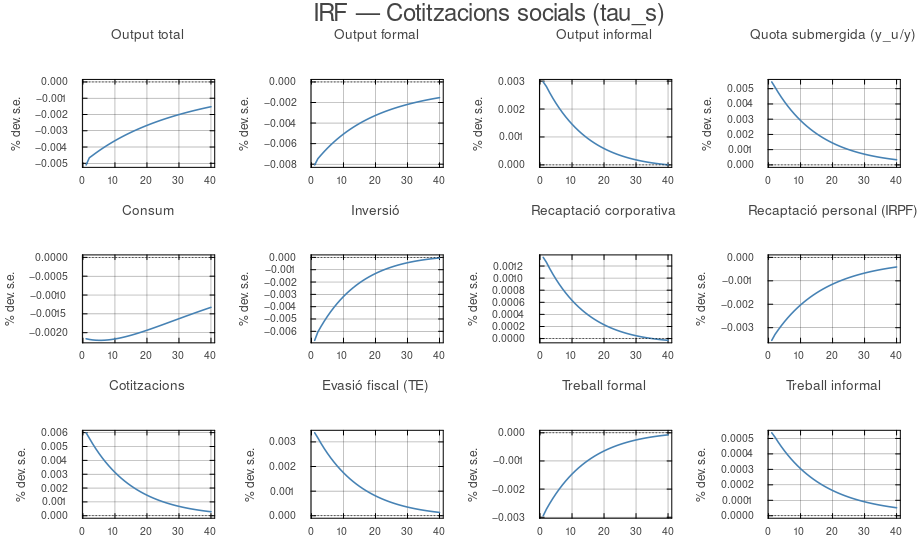
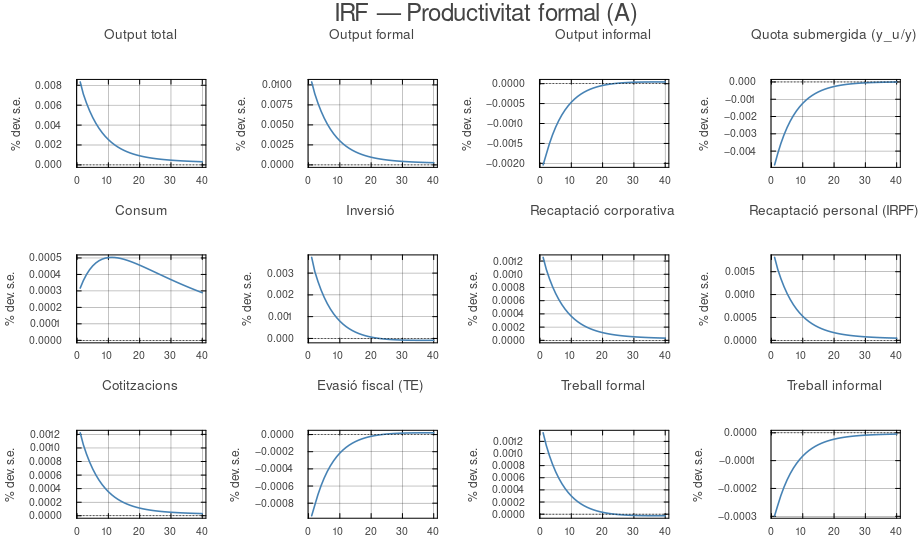
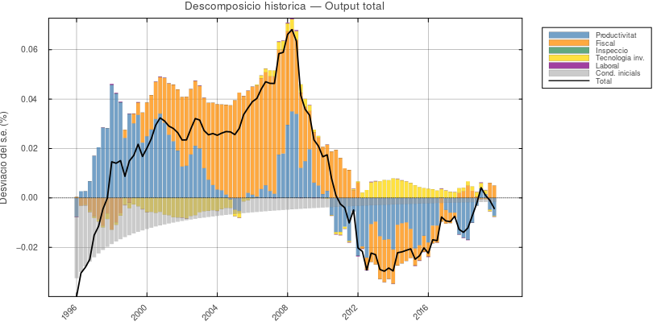
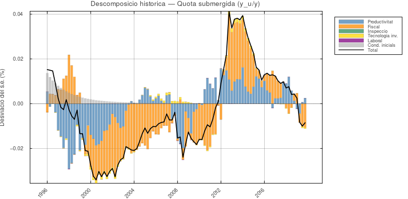

# ANÀLISI DE POLÍTICA ECONÒMICA: ESPANYA {#sec-analisis}

Un cop estimat el vector de paràmetres $\hat{\Theta}$ amb dades espanyoles 1996–2019, el model es converteix en un laboratori per avaluar polítiques econòmiques. Aquest capítol organitza l'anàlisi en tres blocs: els mecanismes de transmissió dels xocs fiscals (funcions d'impuls-resposta), els determinants de les fluctuacions observades i la seva lectura histórica (descomposició per xocs i episodis histórics) i les implicacions de llarg termini per al disseny de la política fiscal (corbes de Laffer i contrafactuals). El fil conductor és únic: a Espanya, l'economia submergida és principalment un fenomen de política fiscal, no un fenomen de productivitat.

Un primer resultat de l'estimació és la dimensió implícita del sector submergit a l'estat estacionari. Avaluant el model als paràmetres estimats $\hat{\Theta}$ i resolent l'equilibri d'estat estacionari, s'obté una quota submergida $y^u/y = 17.81\%$ del PIB. Aquest valor és consistent amb les estimacions independents per a Espanya de @medinaShadowEconomiesWorld2018 (que situen l'economia informal espanyola entre el 17% i el 22% del PIB per al període 1996–2019) i inferior al 20–24% que @OrsiInformal obtenen per a Itàlia, diferència coherent amb els tipus impositius efectius menors a Espanya ($\tau^c_{ss} = 25\%$ vs. $40\%$ italià).

## Funcions d'Impuls-Resposta: Mecanismes de Transmissió {#sec-irfs}

Les funcions d'impuls-resposta (IRF) quantifiquen la resposta de cada variable davant d'una pertorbació unitària ($+1\sigma$) a cada xoc estructural, resolent el sistema linealitzat al voltant de $\hat{\Theta}$. Les IRF de l'IRPF ($\tau^h_t$), la inspecció ($p_t$) i els xocs de preferències ($B_t$, $\xi^h_t$, $\xi^x_t$) es recullen íntegrament a l'@sec-annex-irf.

### Xocs Fiscals: IS i Cotitzacions Socials {#sec-irf-fiscal}

Els dos xocs fiscals principals comparteixen el mateix mecanisme de transmissió l'**efecte de reasignació de recursos** però operen a través de canals diferents.

{#fig-irf-c}

Un xoc positiu d'1σ de l'IS (@fig-irf-c) genera una caiguda de l'output total de −0.3 pp, persistent per la semivida elevada del procés AR(1) ($\rho_c = 0.946$, semivida ~12 trimestres), amb l'output formal caient −0.7 pp i la inversió −0.5 pp; simultàniament, la quota submergida puja +0.6 pp i l'evasió fiscal +0.25 pp. El canal és el cost del capital: l'augment del tipus redueix la rendibilitat de l'activitat formal i desplaça inversió i producció cap al sector no declarat. La recaptació corporativa puja inicialment (l'efecte-tipus domina l'efecte-base a curt termini) però es redueix a mesura que la base imposable es baixa, com es veu a la dinàmica de la corba de Laffer de la secció @sec-long-run.

{#fig-irf-s}

Les cotitzacions socials (@fig-irf-s) actuen sobre el cost laboral i generen l'impacte quantitatiu més fort de tots els xocs fiscals: l'output total cau −0.5 pp, l'output formal −0.8 pp i la inversió −0.6 pp, tots superiors als de l'IS; la quota submergida puja +0.5 pp i el treball formal cau −0.3 pp. La major potència reflecteix la variància estimada excepcionalment elevada ($\sigma_s = 13.2\%$), conseqüència de les variacions substancials de les cotitzacions patronals espanyoles durant el període mostral. El xoc d'inspecció fiscal ($p_t$), en canvi, presenta multiplicadors de l'ordre de $10^{-6}$: la variància del xoc col·lapsa al límit inferior de la prior per manca de variació temporal en la sèrie, de manera que les fluctuacions de $p_t$ no generen cap efecte cíclic detectable.

### Xoc Tecnològic i Altres Pertorbacions {#sec-irf-tech}

{#fig-irf-a}

El xoc de productivitat del sector formal ($A_t$) és el cas polar dels xocs fiscals: un xoc positiu d'1σ eleva l'output total ~0.8 pp, redueix la quota submergida ~0.4 pp i incrementa la recaptació, tot simultàniament i sense cap acció de política. El mecanisme és el mateix efecte de reasignació de recursos operat en sentit invers: la millora de productivitat formal eleva el salari net del sector regular, eixamplant el diferencial de remuneració a favor de la formalitat; les hores de treball es realloquen de l'informal al formal ($n^u \downarrow$) i, com que l'output informal depèn directament d'aquestes hores, $y^u$ cau. La quota submergida es contrau per les dues bandes mentre l'evasió es comprimeix. Amb xocs fiscals, la pressió sobre el sector formal empeny activitat cap a la informalitat; amb un xoc de productivitat, el sector formal xucla recursos del submergit. La persistència moderada ($\rho_a = 0.86$, semivida ~4.6 trimestres) és coherent amb la dinàmica del cicle espanyol.

El xoc de preferències intertemporals ($B_t$) actua principalment sobre el consum i l'estalvi (una caiguda del factor de descompte redueix el consum present i comprimeix el PIB per la via de la demanda), però el seu efecte sobre la quota submergida és pràcticament nul: la decisió de formalitat depèn del diferencial de rendibilitat entre sectors, no de les preferències temporals de les llars. La seva contribució a la variància de la quota submergida no supera l'1,8%.

## D'on venen les fluctuacions? {#sec-fevd-hist}

Si mirem quins xocs expliquen les oscil·lacions de cada variable, el resultat és clar: la quota submergida respon principalment als xocs fiscals, no als de productivitat. La mateixa pauta es repeteix per al consum, la inversió i l'evasió. Dit d'una altra manera: quan puja l'impost de societats, l'economia informal s'expandeix; quan la productivitat millora, quasi no es mou. @OrsiInformal obtenen el mateix resultat per a Itàlia. Que coincideixi en dos països amb sistemes fiscals i períodes mostrals tan diferents apunta que el mecanisme és real, no un artefacte de les dades espanyoles.

La descomposició histórica concreta aquest resultat per a cada trimestre: assigna, per a cada variable, la fracció del desviament respecte a l'estat estacionari atribuïble a cada grup de xocs. Tècnicament s'obté aplicant el filtre de Kalman: donat $\hat{\Theta}$, el filtre identifica la seqüència de xocs que maximitza la versemblança de les dades, i la descomposició acumula les respostes impulso-resposta ponderades per les realitzacions filtrades. Permet llegir el cicle econòmic espanyol episodi a episodi.

{#fig-hd-y}

{#fig-hd-underground}

Les figures @fig-hd-y i @fig-hd-underground llegides conjuntament revelen el doble cost de l'austeritat espanyola. Durant l'**expansió pre-crisi (1996–2008)**, els xocs fiscals contribuïen positivament al PIB (la convergència europea va comportar una reducció dels tipus efectius) i negativament a la quota submergida: el boom formal comprimia la informalitat. La ruptura és simultània en ambdues variables a partir de 2010–2012: les pujades dels tipus efectius de l'IS, l'IRPF i les cotitzacions patronals apareixen com a xocs fiscals que, en el PIB, actuen a la baixa i, en la quota submergida, actuen a l'alça. L'austeritat, doncs, va reduir l'activitat formal i va inflar l'economia submergida al mateix temps, dos efectes que les estadístiques d'output convencionals amaguen però que el model separa. Durant la **recuperació (2015–2019)**, les contribucions es normalitzen gradualment, impulsades sobretot per la recuperació de la productivitat formal; la persistència d'alguns increments fiscals de l'austeritat explica per qué la quota submergida va tardar a retrocedir malgrat la recuperació del PIB.

## Implicacions de Llarg Termini i Política Fiscal {#sec-long-run}

### Corbes de Laffer {#sec-laffer}

La corba de Laffer descriu la relació d'estat estacionari entre el tipus impositiu d'un instrument i la recaptació que genera. Per construir-la, es recalcula l'equilibri d'estat estacionari per a una graella de valors de l'instrument mantenint fixos tots els altres paràmetres $\hat{\Theta}$. L'exercici és rellevant perquè permet identificar si l'economia es troba al tram ascendent o descendent de la corba (és a dir, si una pujada d'impostos augmenta o redueix la recaptació) i perquè quantifica els efectes sobre el benestar i la quota submergida associats a cada nivell del tipus. Les corbes per als quatre instruments ($\tau^c$, $\tau^h$, $\tau^s$, $p$) es troben a l'@sec-annex-laffer.

El resultat és consistent en els tres impostos de base àmplia: **Espanya es troba al tram ascendent de la corba de Laffer**. El màxim de recaptació total s'assoleix a tipus superiors als actuals en tots els casos, de manera que hi ha marge teòric de pujada sense reduir els ingressos fiscals agregats. No obstant, la recaptació creixent s'acompanya invariablement de benestar decreixent i d'expansió de la quota submergida: a mesura que puja el tipus, una fracció creixent d'activitat migra al sector no declarat, erosionant la base imposable i comprimint el benestar. La inspecció fiscal ($p$) presenta un perfil diferent: la recaptació creix monòtonament en tot el rang analitzat sense que s'identifiqui un màxim, però els efectes macroeconòmics sobre el PIB i la quota submergida són molt limitats, el rang de variació de la quota submergida en tot l'interval $p \in [0.001, 0.15]$ és inferior a 1.5 punts percentuals.

### Contrafactuals de Política {#sec-contrafactuals}

Un contrafactual d'estat estacionari compara l'economia al seu equilibri estimat amb un equilibri alternatiu en el qual el govern ha canviat un o més instruments de política de forma **permanent**. Tècnicament, per a cada escenari es recalcula l'estat estacionari als nous paràmetres mantenint fixos tots els altres elements de $\hat{\Theta}$, i es reporta la variació percentual de cada variable respecte al baseline. El benestar es mesura mitjançant la variació equivalent de consum (ECV, $\lambda$): el percentatge de consum permanent que val la reforma per a les llars, definit com $\lambda = \exp\!\bigl((1-\beta)(W_{CF}-W_{base})\bigr)-1$; valors positius indiquen millora de benestar.

La @tbl-contrafactuals recull els quatre escenaris analitzats.

**CF1 i CF2: el dilema simètric de l'IS.** Els dos primers contrafactuals mostren la resposta de l'economia a un canvi de ±5 pp del tipus de l'IS. La reducció (CF1) genera un augment del PIB del +2.9%, una caiguda de la quota submergida del −8.6% i una millora del benestar equivalent a un +3.85% de consum permanent (ECV positiu); la inversió puja un +7.2% i el consum un +3.7%. El resultat més sorprenent és que la **recaptació total cau únicament un −0.2%**: la pèrdua directa de recaptació corporativa (−17.7%) queda gairebé completament compensada per l'expansió de la base de l'IRPF (+7.8%) i de les cotitzaciones (+6.1%) que acompanya la formalització. La reducció de l'IS és, per tant, quasi autofinançable a llarg termini, cosa que situa Espanya molt propera al punt màxim de la corba de Laffer per a aquest instrument. La pujada (CF2) confirma el resultat en mirall: el PIB cau −3.0%, la quota submergida puja +9.9%, el benestar empitjora en un −4.2% de consum equivalent (ECV negatiu), i la recaptació total tampoc millora (−0.3%), evidenciant que Espanya es troba al tram en el qual pujar l'IS no augmenta la recaptació neta.

| Variable | CF1: IS −5pp | CF2: IS +5pp | CF3: IS −5pp + $p$×1.5 | CF4: IS +5pp + Cot. −5pp |
|:---|:---:|:---:|:---:|:---:|
| PIB total | +2.94% | −3.04% | +2.92% | −2.65% |
| Output formal | +4.51% | −4.73% | +4.59% | −3.02% |
| Quota submergida | −8.65% | +9.88% | −9.20% | +2.16% |
| Consum | +3.66% | −3.68% | +3.59% | −0.05% |
| Inversió | +7.18% | −6.74% | +6.99% | −7.31% |
| Recaptació total | −0.22% | −0.27% | −0.08% | −3.65% |
| Evasió fiscal | −9.51% | +10.55% | −10.34% | −3.63% |
| **ECV (benestar)** | **+3.85%** | **−4.20%** | **+3.79%** | **−0.20%** |

: Canvis percentuals respecte al baseline ($\hat{\tau}^c_{ss}=0.25$, $\hat{\tau}^s_{ss}=0.23$, $\hat{p}_{ss}=0.026$). ECV positiu indica millora de benestar: el percentatge de consum permanent que la reducció de l'instrument val per a les llars. {#tbl-contrafactuals}

**CF3: el paper limitat de la inspecció.** Combinant la reducció de l'IS amb un reforç de la inspecció ($p_{ss}: 0.026 \to 0.039$), la quota submergida cau lleugerament més que amb CF1 sol (−9.2% vs. −8.6%) i la recaptació total és pràcticament neutral (−0.08%). No obstant, el benestar millora marginalment menys que en CF1 (+3.79% vs. +3.85% d'ECV): la major inspecció redueix l'activitat informal, que té valor per a les llars, generant un petit cost de benestar que compensa parcialment el guany de la reducció de l'IS. La conclusió és consistent amb l'anàlisi de les IRF: la inspecció és un complement menor de la reforma fiscal, no un substitut.

**CF4: la composició de la pressió fiscal importa.** L'últim escenari desplaça la càrrega fiscal del treball cap al capital: l'IS puja 5 pp però les cotitzaciones socials baixen 5 pp simultàniament. Els efectes il·lustren per qué la composició del sistema tributari, i no només el seu nivell, determina els resultats macroeconòmics. El consum és pràcticament inalterat (−0.05%) i el benestar quasi neutral (−0.20% d'ECV, enfront del −4.20% de CF2): la baixada de cotitzaciones allibera renda laboral i compensa gairebé exactament el cost de la pujada de l'IS sobre les llars. La quota submergida augmenta molt menys que en CF2 (+2.2% vs. +9.9%) perquè la reducció del cost del treball formal contrarresta el major incentiu a evadir l'IS. El cost del paquet és fiscal: la recaptació total cau un −3.6% perquè la pèrdua directa per la reducció de cotitzaciones és molt major que el guany de l'IS. CF4 evidencia que un rebalanceig de la fiscalitat (del treball cap al capital) podria preservar el benestar i contenir la informalitat a un cost recaptatori significatiu a curt termini.

